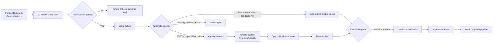
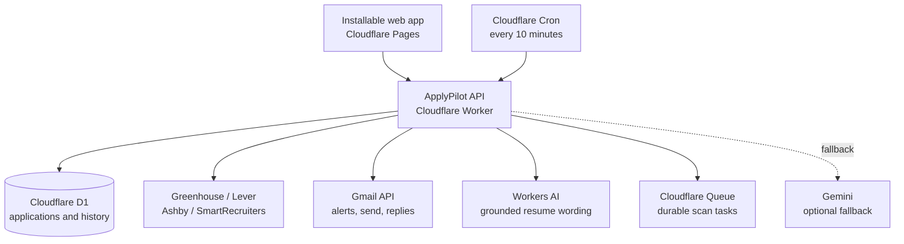

<div align="center">

# ApplyPilot

### A personal, cloud-hosted job-search command center

[](https://applypilot.pages.dev)
[](https://www.cloudflare.com/)
[](#testing)
[](https://github.com/rizz1406/apply-pilot)

Find high-fit roles, build grounded ATS resume packs, track every application, and send recruiter follow-ups only after approval. Works on desktop and mobile with no laptop left running.

</div>

> [!IMPORTANT]
> ApplyPilot does not bypass job-board logins, CAPTCHA, legal declarations, or protected applicant forms. It automates the work around those steps and hands off the official submission safely.

## What it does

| Discover | Match | Prepare | Track | Follow up |
| :---: | :---: | :---: | :---: | :---: |
| Public ATS boards, official career pages, and Gmail job alerts | Skills, role, location, experience, salary, learned preferences, and work mode | Truthful ATS-tailored resume pack, project selection, and audit | Inbox, proof-aware pipeline, documents, and application events | Gmail drafts, explicit approval, reply detection |

## The workflow



### Match rules

Set one primary target and any number of additional titles in **Settings**. ApplyPilot evaluates all of them against every supported job description.

```text
Primary:       Data Analyst
Additional:    Senior Data Analyst, BI Analyst, Analytics Engineer, Junior Data Engineer
Minimum score: 65%  (adjustable from 50% to 95%)
```

The default policy sends roles scoring **65-87%** to approval and allows roles at **88%+** into the automatic path. Hard conflicts and risk flags always override the score. Automatic submission is enabled only when a candidate-owned provider connector is configured; otherwise ApplyPilot prepares the pack and uses an official portal handoff.

## Built for a real application history

The Pipeline stores the details needed to run an organized search:

- Company, role, official application URL, source, score, and application stage
- Submitted date and activity timeline
- The specific ATS resume pack, LaTeX export, keyword coverage, and claim audit
- Recruiter drafts, sent timestamps, Gmail thread identifiers, and detected replies

Use **Review resume, audit & history** on a pipeline card to inspect the pack tied to that application.

## Architecture



| Service | Role | Cost model |
| --- | --- | --- |
| Cloudflare Pages | Responsive web and mobile PWA | Free tier |
| Cloudflare Worker | API, matching, scheduled scans, Gmail actions | Free tier limits |
| Cloudflare D1 | Search profile, jobs, applications, outreach, activity | Free tier limits |
| Cloudflare Queues | Retried and auditable scan tasks | Free tier limits |
| Gmail API | Alert import, approved sends, reply tracking | Google quota limits |
| Workers AI | Primary grounded resume wording and audit workflow | Cloudflare free allocation limits |
| Gemini | Optional fallback when configured | Optional provider quota/limits |

The cloud scan runs every **10 minutes**, even when your laptop is off. It checks configured public ATS boards, imports supported job-alert emails, deduplicates jobs, applies your rules, and records high-fit roles for review. It cannot promise instant discovery of every job on the internet; speed depends on the monitored sources and alert delivery.

## Supported sources

| Direct JD discovery | Official alert and handoff sources |
| --- | --- |
| Greenhouse, Lever | LinkedIn job alerts |
| Ashby, SmartRecruiters | Naukri job alerts |
| Workable, Recruitee | Indeed job alerts |
| Official career-page JSON-LD | Company and ATS alert emails |

Direct ATS roles include a full job description and can be scored accurately. Portal alert cards are official links, not presumed full JD matches; they require JD review before tailored resume creation.

Teamtailor's official API requires an employer-issued token. Add the company's public careers URL through **Official career page** instead; ApplyPilot reads public `JobPosting` structured data when the site provides it. It never asks for or bypasses employer credentials.

## Decision and verification controls

- **Opportunity Inbox** combines strong matches, follow-ups, replies, submission proof, and interviews into one prioritized queue.
- **Relevant / Not relevant** feedback adjusts future scores by at most 12 points; hard location, salary, seniority, and exclusion rules still win.
- **Submission states** distinguish form opened, submitted but unconfirmed, and confirmed through Gmail or recorded manual evidence.
- **AI budget** is configurable. When the daily allowance is reached, the verified deterministic resume workflow remains available.
- **Interview cockpit** keeps JD questions, SQL practice, STAR prompts, a 30/60/90 outline, and interviewer questions with the application.

## Safe automation boundaries

| Automated | Requires your action |
| --- | --- |
| Job scanning, filtering, policy routing, JD-specific resume generation, tracking, email drafting, scheduled checks, candidate-API eligibility routing | Portal login, CAPTCHA, declarations, unknown screening answers, protected form submission, final recruiter-email approval |

Every job retains its automation decision and reason. A provider connector must be separately configured and enabled before an eligible item can submit; the default deployment uses official portal handoff. Applications are recorded as confirmed only after provider evidence, Gmail confirmation, or explicit manual proof. The **Approve & send** button remains required before Gmail sends recruiter follow-up.

## Run locally

```powershell
# Install dependencies
npm.cmd install

# Create local D1 state and start the Worker
npm.cmd run db:local
npm.cmd run dev
```

For the static interface alone:

```powershell
python -m http.server 4173 --bind 127.0.0.1
```

Open `http://127.0.0.1:4173`. Copy `.dev.vars.example` to `.dev.vars`, choose a long `ADMIN_TOKEN`, and enter the same token in Settings when testing the local Worker.

## Deploy on the free tier

1. Create a Cloudflare account and authenticate Wrangler.
2. Create a D1 database and place its `database_id` in `wrangler.toml`.
3. Create `applypilot-tasks` and `applypilot-tasks-dlq` Queues, then run `npm.cmd run db:remote`.
4. Add Worker secrets: `ADMIN_TOKEN`, Google OAuth values, Gmail refresh token, and optionally `GEMINI_API_KEY`.
5. Run `npm.cmd run deploy` for the Worker and deploy `public/` to Cloudflare Pages.
6. Set `APP_ORIGIN` to the Pages domain and keep `DEMO_MODE=false`.

Detailed deployment, operating, and security instructions are available here:

- [Operations guide](docs/OPERATIONS.md)
- [Security and privacy](docs/SECURITY.md)
- [Worker variables example](.dev.vars.example)

## Repository map

```text
app.js / styles.css / index.html  PWA source
public/                           Cloudflare Pages deployment output
worker/                           API, discovery, matching, Gmail, AI services
migrations/                       Cloudflare D1 schema history
test/                             Discovery, matching, outreach, Gmail and tailoring tests
docs/                             Operating and security documentation
resume-tailor/                    Standalone tailoring prototype/reference
```

## Testing

```powershell
npm.cmd test
```

The suite covers job-board and career-page parsers, learned preference guardrails, project selection, matching rules, job-alert title handling, Gmail send behavior with mocks, submission verification, interview preparation, ATS-safe LaTeX, resume claim auditing, and stable application packs.
